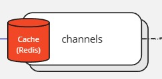

# Telegram 

---
*To begin with, my goal was to make design for a light Telegram version.
Of course, not all the functions are implemented and not all my
decisions are perfect for that use case. I omit data models; the main goal
is to make system design*

---

## Gateway

The first step was to make gateway. 
Here, all incoming requests will be checked for the matter of authorization, 
and then will be procedured to required service which instance will be chosen
by load balancer. It is also implements rate limiting (by user's token) and circuit
breaking functionality. It will help the system to handle the load.

My choice was to make the gateway combine data from different data source (services),
for example, if a user needs to get  all his chats, the first request will go to
'chats' service to get all chats, the second request will be sent to profile
service to get users avatar and nicknames.

---

## Chats

The most important part of Telegram is its chat part. 
Gateway redirects http/websocket requests to one of the instances, 
then a message is being sent to redis pub/sub and stored in DB.

First of all, user privacy is the most important, that is why all
personal data is being hashed before processing, and before retrieving
dehashed.

Here, we send a message to redis pub/sub because we have multiple 
instances of 'chats' service. All instances consume the message, and 
if the current user is online, they send him his message, 
if not they don't. After that stage, the message just being stored to DB.

Cache is being used to cache repeating requests to get chat history.
It should be updated after each new message.

As DB, I have chosen Mongo because it is suitable for a high load and
storing data that may significantly differ(f.e a message may have attached files, reply etc.) 

To store files, any s3 storage is suitable.

---

## Auth

We need somehow to identify user.
One option was to make 1 more service 
which would consume messages from the broker and send email or push.
But for the sake of simplifying, I just decided to use default jwt tokens with login-password.
Before making any kind of request, gateway goes to auth service and checks if
user access is allowed. So as not to overload the service, it is cache that will instantly 
 give a response while ttl is not expired. So the gateway needs to check token only one time,
and then, if it doesn't change, there will be no need to do it again while
token won't expire.

Gateway communicates with this service via gRPC, gRPC was chosen due to its fast.

I haven't mentioned, but of course all confidential user data has to be hashed.

As DB, there is a common and widely accepted solution—Postgres. Its indexes 
would allow 'auth' service to get user data fast by its id.

---

## Channels

The major part of Telegram's success is its channel feature.

Gateway communicates with this service via gRPC, 
gRPC was chosen due to its fast.

So as not to repeat myself, 
Mongo was chosen for the same reason as in chat service. Data structure may significantly 
differ.

Files are stored in s3 too.

To make searching the channel more convenient and accurate, I decided to use
ElasticSearch. Searching will be via channels name and description.

Cache—Redis.
Here cache is also being updated after any new post in the channel; it keeps the last 10 
posts, without comments, comments will be fetched only if user drops to a comments section.
So it will handle all the incoming requests.
Also, after creating a post, all subscribed users will receive a notification,
the service will send a message via NATS to 'notification' service.
But if a user wants to get some
older ones, service will have to retrieve data with offset and pagination, it won't
be cached because it is no need, not really often people search them.

Comments—my decision was to make default gRPC handler for that, and a client if
it needs will ask for them after any tick period. It is no need to establish one 
more websocket connection here.

The other operations are default crud.

---

## Profile

Gateway communicates with this service via gRPC, for the same reason as earlier said.
Default crud service. User changes his/her data not really often; that is why cache
will take all the load on itself.

As DB - Mongo, high load resistant and comfortable for different data structures
(f.e. profile may have many photos, different 'about myself' sections)

---

## Contacts

Gateway communicates with this service via gRPC, for the same reason as earlier said.
Cache will handle repeating requests to get a contact list.
Friend invitation has its version, f.e. 'pending', 'accepted', 'denied'.

Postgres - because of structured data and hash indexes on user id field to search faster.

---

## Notifications

Service which consumes data from a messaging system and then sends notifications to users.
In this case, push-notifications. For that may be used Firebase.

---
## Messaging system

First of all, the goal was to find a fast and reliable solution that will handle
a high load.

I had a choice between *Redis PUB/SUB* and *NATS*. Both are fast.
In real time chat app it is crucial. In 'chats' service, I made a choice
in favor of Redis because it is good for real-time messaging in scenarios 
where real-time data access and caching are important, 
chatting is exactly suitable.

But for the other scenarios the winner was *NATS*. It is suitable for
high-performance messaging, and microservices that require reliable 
communication 
with support for delivery guarantees, persistence, and robust scaling.
Channels have more traffic than chats and notifying users about new data
is really that important, is why here won the reliability and 
high-performance messaging.

## Transfer protocols

* gRPC - is fast and handles high load. That is the main reason why it suits
here. As for me, it is the best way to make inter-service communication.
Transferring files may be implemented via gRPC streaming feature.
* Websockets/HTTP - websocket is an optimal solution for real-time communication.
And for the sake of simplicity, the other functionality(crud) in the 'chat' service is also
using http. The gateway uses HTTP to communicate with clients.

## Metrics and monitoring

Each service should be covered with metrics (rps, memory usage, response status codes, etc.), so we could monitor services state.
Nice solution will be Prometheus/Grafana. Moreover, tracing with OTel.

## Databases

* *Mongo* - is used by services where data structure may differ and required
high performance. Also supports different scalability strategies from the box.
* *Postgres* - is used by services where data is structured and expected 'select'
operations where indexes are good enough. Scalability strategies may be implemented.