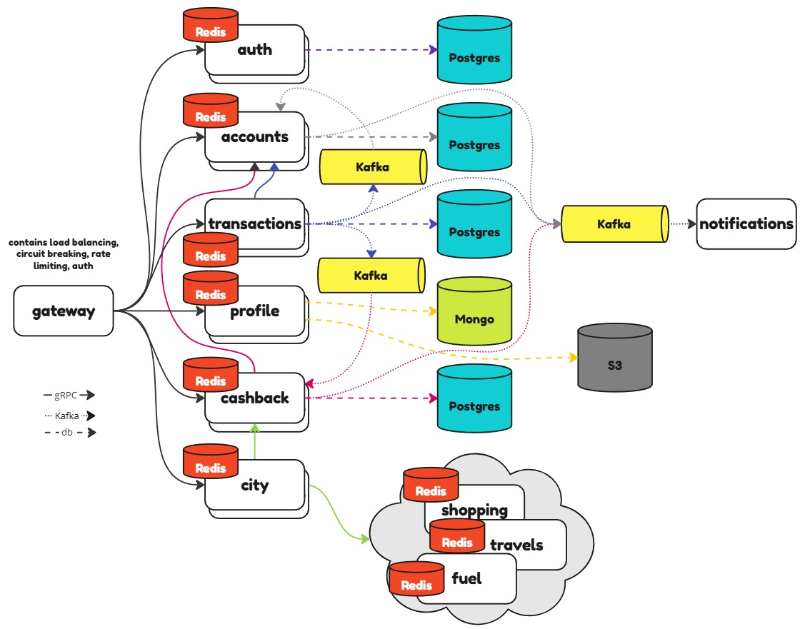
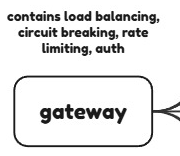
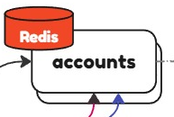
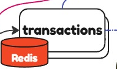
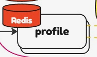
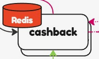
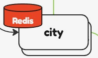
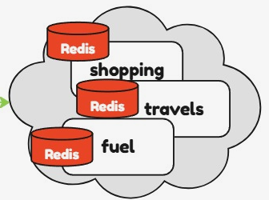
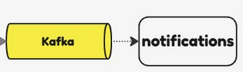

# Tinkoff

---

*To begin with, my goal was to make design for a light Tinkoff Bank version.
Of course, not all the functions are implemented and not all my
decisions are perfect for that use case. I omit data models; the main goal
is to make system design*

---

## Gateway

The first step was to make gateway.
Here, all incoming requests will be checked for the matter of authorization,
and then will be procedured to required service which instance will be chosen
by load balancer. It is also implements rate limiting (by user's token) and circuit
breaking functionality. It will help the system to handle the load.

My choice was to make the gateway combine data from different data sources (services) and
make services communicate with each other. So sometimes gateway may need to make
multiple requests to services or to make one request and service will get
all info required from other services.

**In**: *HTTP*

**Out**: *gRPC* (fast)

---

## Auth

Our app contains really sensitive data. So we need to make it safe. The first step is 
to make `auth` service. It should authenticate incoming requests and detect
those who use expired or wrong token.

**DB**: *Postgres* (indexes)

**Cache**: *Redis* (fast, well suited for cache)

**In**: *gRPC* 

---

## Accounts

Users need to keep track of their finances and open new accounts. So this service
`accounts` should provide them this functionality.

It also receives data from `transaction` and `cashback` services
to update user's balance.

For example, `transactions` service while making a transaction:

`transactions` service:
1. Make gRPC request to `accounts` service to check if sender has enough money,
   if not then cancel transaction.
2. Insert data into `transactional outbox` with status `pending`.
3. Worker selects all data with `pending` status and sends a
   Kafka message to debit money from sender's balance and credit
   them to recipient's balance. Update status to `succeeded` in outbox.

`accounts` service:
1. Consume a message from the topic and update balances. It may also be implemented
   `transactional inbox`. Each message should have its idempotency key to make each
   transaction unique.

Moreover, user needs to be notified after any update of his account, also via Kafka topic.

**DB**: *Postgres* (indexes, ACID)

**Cache**: *Redis* (fast, well suited for cache)

**In**: *gRPC, Kafka*

**Out**: *Kafka* (asynchronous, no need to wait for response, reliable)

---

## Transactions

This service manages transactions. Example of interacting with `accounts` service
was mentioned [here](#accounts).

`cashback` service is also being notified via Kafka.

User receives notification after any transaction.

**DB**: *Postgres* (indexes, ACID)

**Cache**: *Redis* (fast, well suited for cache)

**In**: *gRPC*

**Out**: *gRPC, Kafka* (fast; asynchronous, no need to wait for response, reliable)

## Profile

This service manages user's data. Nothing special.

**DB**: *Mongo* (convenient scalability, flexible data structures, BASE is acceptable)

**Cache**: *Redis* (fast, well suited for cache)

**In**: *gRPC*

**Out**: *gRPC, HTTP* 

## Cashback

This service consumes messages from Kafka topic. Then, stores it in Postgres DB.
One time in some period calls `accounts` service to manage user's account based on
user's cashback.

Also, `city` service notifies `cashback` service about new actions.

**DB**: *Postgres* (indexes, ACID)

**Cache**: *Redis* (fast, well suited for cache)

**In**: *gRPC*

**Out**: *gRPC, Kafka* 

## City

This service communicates with other services that interact with partners, 
and they share the data about cashback, discounts etc. Then it provides that data to `cashback`
service.

**DB**: *None* (no need to store any data, just to transfer it from a group of services to `cashback`)

**Cache**: *Redis* (fast, well suited for cache)

**In**: *gRPC*

**Out**: *gRPC* 

## Notifications

This service consumes messages from Kafka topic and notifies user about any info he/she
needs to know. Kafka has been chosen for its reliability, because in our system
we operate with crucial data and user has to be in course of any operation.

**DB**: *None* 

**Cache**: *None* 

**In**: *Kafka*

**Out**: *smtp, push notification* 

---

## Messaging system

* *Kafka* - reliable, performance, throughput, scalability.

## Transfer protocols

* gRPC - is fast and handles high load. That is the main reason why it suits
  here. As for me, it is the best way to make inter-service communication.

## Metrics and monitoring

Each service should be covered with metrics (rps, memory usage, response status codes, etc.), so we could monitor services state.
Nice solution will be Prometheus/Grafana. Moreover, tracing with OTel.

## Databases

* *Postgres* - is used by services where data is structured and expected `select`
  operations where indexes are good enough. Scalability strategies may be implemented.
   `ACID` is the most important aspect why it was chosen, our system operates crucial 
   data, so it has to be consistent.

* *Mongo* - is used by services where data structure may differ and required
  high performance. Also supports different scalability strategies from the box. In `profile`
  service eventual consistence is acceptable, that is why Mongo will be the best solution to
  scale the system.