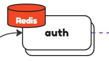

# Tinkoff

---

*To begin with, my goal was to make design for a light Tinkoff Bank version.
Of course, not all the functions are implemented and not all my
decisions are perfect for that use case. I omit data models; the main goal
is to make system design*

---

## Gateway

The first step was to make gateway.
Here, all incoming requests will be checked for the matter of authorization,
and then will be procedured to required service which instance will be chosen
by load balancer. It is also implements rate limiting (by user's token) and circuit
breaking functionality. It will help the system to handle the load.

My choice was to make the gateway combine data from different data sources (services) and
make services communicate with each other. So sometimes gateway may need to make
multiple requests to services or to make one request and service will get
all info required from other services.

**In**: *HTTP*

**Out**: *gRPC* (fast)

---

## Auth

Our app contains really sensitive data. So we need to make it safe. The first step is 
to make `auth` service. It should authenticate incoming requests and detect
those who use expired or wrong token.

**DB**: *Postgres* (indexes)

**Cache**: *Redis* (fast, well suited for cache)

**In**: *gRPC* 

---

## Accounts

Users need to keep track of their finances and open new accounts. So this service
`accounts` should provide them this functionality.

It also receives data from `transaction` and `cashback` services
to update user's balance.

For example, `transactions` service while making a transaction:

`transactions` service:
1. Make gRPC request to `accounts` service to check if sender has enough money,
   if not then cancel transaction.
2. Insert data into transactional outbox with status 'pending'.
3. Worker selects all data with 'pending' status and sends a
   Kafka message to debit money from sender's balance and credit
   them to recipient's balance. Update status to 'succeeded' in outbox.

`accounts` service:
1. Consume a message from the topic and update balances. It may also be implemented
   transactional inbox. Each message should have its idempotency key to make each
   transaction unique.

Moreover, user needs to be notified after any update of his account.

**DB**: *Postgres* (indexes, ACID transactions)

**Cache**: *Redis* (fast, well suited for cache)

**In**: *gRPC, Kafka*

**Out**: *Kafka* (asynchronous, no need to wait for response, reliable)

---

## Transactions

This service manages transactions. Example of interacting with `accounts` service
was mentioned [here](#accounts).

`cashback` service is also being notified via Kafka.

User receives notification after any transaction.

**DB**: *Postgres* (indexes)

**Cache**: *Redis* (fast, well suited for cache)

**In**: *gRPC*

**Out**: *gRPC, Kafka* (fast; asynchronous, no need to wait for response, reliable)